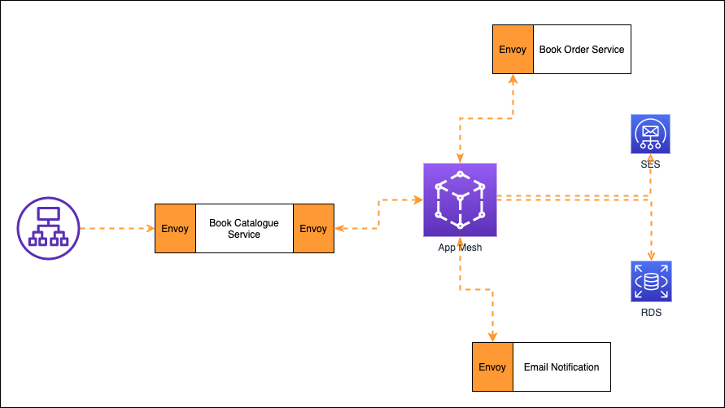

# single account appmesh workshop



**Steps**
- Prerequisite
  - verify two email addresses with SES, these two email addresses will be used to send and receive emails as part of the use case here in this section.
  - SES SMTP settings, you need the following to run this section
    - SES SMTP username
    - SES SMTP password
    - SES SMTP Server name (e.g. email-smtp.ap-southeast-2.amazonaws.com)
  - Set environment variables in **vars.env**
  - Open your ssh terminal and set the environment variables

```
  $ source vars.env
```
- Deploy 3 ECS services (Book Catalogue Service, Book Order Service, Email Notification service) and RDS instance by deploying the CloudFormation stacks provided in this section.

- Run the following to deploy the CloudFormation stacks

```
 $ ./deploy.sh deploy
```

- Deployment will create an EC2 instance, ssh into the EC2 instance using the Key Pair that you mentioned in the vars.env file.

- To find EC2 instance public IP address, go to CloudFormation stack and see Output tab.

- Install mysql client on the EC2 instacne

```
 $ sudo yum install mysql
```

- Once mysql client installed on the EC2 intance, connect to RDS instance that was created by the Cloudformation stack. Use the following to connect from EC2 instance to RDS

```
$ mysql --host=xxxxxxxxxxxxxxxx.us-east-1.rds.amazonaws.com --user=username --password=password database-name
```
  - replcace xxxxxxxxxxxxxxxx.us-east-1.rds.amazonaws.com with your RDS DNS endpoint
  - replace **username** with the username that you mentioned in the vars.env file
  - replace **password** with the password that you mentioned in the vars.env file
  - replace **database-name** with the database-name that you mentioned in the vars.env file

- Once you are connected to the RDS instance from your EC2 instance, create **book** and **book_order** tables in the database/schema that you mentioned in the env.vars file.
  - replace **appmeshdemo** with the database name that you mentioned in the env.vars file.

  ```
  CREATE TABLE `appmeshdemodb`.`book` (
  `id` INT NOT NULL AUTO_INCREMENT,
  `name` VARCHAR(45) NOT NULL,
  `price` INT NOT NULL,
  `genre` VARCHAR(45) NOT NULL,
  `authorname` VARCHAR(45) NOT NULL,
   `authoremailid` VARCHAR(45) NOT NULL,
  PRIMARY KEY (`id`));
  
  CREATE TABLE `appmeshdemodb`.`book_order` (
  `id` INT NOT NULL AUTO_INCREMENT,
  `buyername` VARCHAR(45) NOT NULL,
  `buyeremailid` VARCHAR(45) NOT NULL,
  `bookname` VARCHAR(45) NOT NULL,
  `bookauthor` VARCHAR(45) NOT NULL,
  `bookgenre` VARCHAR(45) NOT NULL,
  PRIMARY KEY (`id`));


### Let's test the application

#### Use the following Curl commands to test scenarios implemented by ECS services

- Add a New Book into the Book table. Replace "youremail@testmail.com" with one of the SES verified email address and <DNS_ENDPOINT> with the your ALB DNS endpoint. 

  - Verify result: You should see a new record in the book table and receive an email on the email address that you mention in the curl command. 

- For ALB DNS endpoint, look at CloudFormation console, output tab.

```
curl -X POST -H "Content-Type: application/json" -d "{\"name\":\"Cross Account App mesh\",\"price\":13.5,\"genre\":\"Technical\",\"authorname\":\"appmesh demo\",\"authoremailid\":\"youremail@testmail.com\"}" <DNS_ENDPOINT>/bookcatalogue/books -v
```

- Get all the books
```
curl http://<DNS_ENDPOINT>/bookcatalogue/books -v
```

- Get a book for a given id
```
curl http://<DNS_ENDPOINT>/bookcatalogue/books/1 -v
```

- Update a book. Replace "youremail@testmail.com" with one of the SES verified email address and <DNS_ENDPOINT> with the your ALB DNS endpoint. 
  
  - Verify result: You should see an updated record in the book table and receive an email on the email address that you mention in the curl command.

```
curl -X PUT -H "Content-Type: application/json" -d "{\"id\": 1, \"name\":\"New AWS Book\",\"price\":203.5,\"genre\":\"Techical\",\"authorname\":\"ECS Workshop 2\",\"authoremailid\":\"youremail@testmail.com\"}" http://<DNS_ENDPOINT>/bookcatalogue/books/1 -v
```

- Delete a book. Replace <DNS_ENDPOINT> with your ALB endpoint.

```
curl -X DELETE -H "Content-Type: application/json" http://<DNS_ENDPOINT>/bookcatalogue/books/1 -v
```

- Place a new book order through Book Catalog Service. Replace "youremail@testmail.com" with one of the SES verified email address and <DNS_ENDPOINT> with the your ALB DNS endpoint. 

  - Verify result: You should see a new record in the book_order and receive an email address that you mention in the curl command.

```
curl -X POST -H "Content-Type: application/json" -d "{\"bookid\":2,\"buyername\":\"User 30\",\"buyeremailid\":\"youremail@testmail.com\",\"bookname\":\"Docker Containers\",\"bookauthor\":\"ECS Workshop\", \"bookgenre\": \"Technical\", \"comments\":\"This is just a test\"}" http://<DNS_ENDPOINT>/bookcatalogue/neworder -v

```

#### You successfully testes ECS services deployed on ECS cluster with Appmesh configuration!