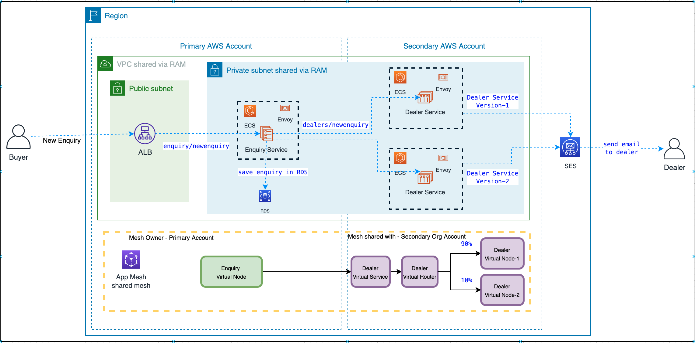

## Overview

This section shows how to use App Mesh between multiple accounts for cross account communication. In this section, we will create a VPC and Mesh in one account (the primary account) and share those resources with another account (the secondary account). We will then deploy applications into the mesh that show they are communicating on a single network, configured by App Mesh.

### Prerequisites
- Create an AWS Organisation in your AWS master account, Primary account in section is referring to Organisation master account
- Create a secondary AWS account in AWS Organisation
- In your secondary account, verify two Email addresses in SES
- In your secondary account, perform SES SMTP setting and take a note of SES SMTP Server name (endpoint), SES SMTP username and password.




### Steps

- Clone this repository and navigate to the 2-cross-account-appmesh folder, all commands should be run from this location.
    ```
    cd appmesh-workshop/2-cross-account-appmesh
    ```
- Edit the **vars.env** file and update values of variables as per your environment
    - **Account IDs**: This demo needs two accounts in the same AWS Organization.
        - AWS_PRIMARY_ACCOUNT_ID = primary account id e.g. 111111111111
        - AWS_SECONDARY_ACCOUNT_ID = secondary account id e.g. 222222222222
    - **AWS Profiles**: Set the profile name for Primary and Secondary AWS account, each profile should have credentials set:
        - To set the primary account profile with name "primary", use the following and provide the required details
            ```
                aws configure --profile primary
            ```
        - To set the secondary account profile with name "secondary", use the following and provide the required details
            ```
                aws configure --profile secondary
            ```
        - Verify if the profiles have been set correctly, check using

            ```
            cat ~/.aws/credentials
            ```
        - Set the profile names

            - AWS_PRIMARY_PROFILE=primary

            - AWS_SECONDARY_PROFILE=secondary

    - **Key Pair** : set to the name of an EC2 key pair. This key will be use to test dns lookup. key pair name from your primary account e.g. 
        - KEY_PAIR = key-pair-us-east-1

        See https://docs.aws.amazon.com/AWSEC2/latest/UserGuide/ec2-key-pairs.html
        
        Note: This key pair should be in the primary account. We will be creating a bastion host in the primary account.
   
- Once you have set all the variables, your **vars.env** should be like (I've used some sample values just for the explaination)

    ```
    unset AWS_ACCESS_KEY_ID
    unset AWS_SECRET_ACCESS_KEY
    export AWS_PRIMARY_ACCOUNT_ID=111111111111
    export AWS_SECONDARY_ACCOUNT_ID=222222222222
    export AWS_PRIMARY_PROFILE=primary
    export AWS_SECONDARY_PROFILE=secondary
    export PROJECT_NAME=appmeshdemo
    export AWS_DEFAULT_REGION=us-east-1
    export KEY_PAIR=keypair-us-east-1
    export ENVOY_IMAGE=840364872350.dkr.ecr.us-east-1.amazonaws.com/aws-appmesh-envoy:v1.12.2.1-prod
    export BOOK_IMAGE=unleashcontainers/bookcatalogueservice:2.0
    export EMAIL_IMAGE=unleashcontainers/emailnotificationservice:2.0
    ```

- Set the environment variables

    ```
    $ cd appmesh-workshop/2-cross-account-appmesh
    
    ```

    ```
    $ source vars.env
    ```

    Check if environment variables have been setup by running the "env" on the terminal.

    ```
    env

    ```

- Let's put things in action by deploying all stacks in primary and secondary accounts by running the following command from 

    Note: run it from this location : appmesh-workshop/2-cross-account-appmesh
           
    ```
    ./deploy.sh deploy

    ```
- Once the installation is complete you will get ALB endpoint, Bastion IP and RDS Endpoint
    - Application is available at <Application Load Balancer Endpoint>
    - Bastion ip is <Bastion IP>
    - RDS DNS Endpoint is <RDS DNS Endpoint>

### Cross account mesh in action

- Open new ssh session on your laptop and connect to EC2 instance and create Enquiry table in RDS

- From your local ssh terminal
    ```
    $ ssh -i your-region-ec2.pem ec2-user@<Bastion IP>
    ```

- Within EC2

    ```
    $ sudo yum install mysql

    $ mysql --host=<RDS DNS Endpoint> --user=appmeshdemodb --password=appmeshdemodb appmeshdemodb

    $ CREATE TABLE `appmeshdemodb`.`enquiry` (
        `id` INT NOT NULL AUTO_INCREMENT,
        `buyername` VARCHAR(45) NOT NULL,
        `buyeremailid` VARCHAR(100) NOT NULL,
        `cartype` VARCHAR(45) NOT NULL,
        `carbrand` VARCHAR(45) NOT NULL,
        `carid` VARCHAR(45) NOT NULL,
        PRIMARY KEY (`id`));
    ```
- Open a new local ssh terminal to test the application and use the following curl command to test if enquiry service that is deployed in your Primary Account is up and running.

    ```
    // This is just a health check to make sure enquiry service is up and running

    curl <Application Load Balancer Endpoint>/enquiry/healthcheck
    ```
- Call a newenquiry service to create a new enquiry which internally calls the dealer service running in your secondary account, which sends an email to the email address that you configure in vars.env file. Replace ALB DNS endpoint with your environment ALB DNS endpoint.

    ```
     curl -X POST -H "Content-Type: application/json" -d "{\"buyername\":\"Vikas Bajaj\",\"cartype\":\"SUV\",\"carid\":\"ABC10101\",\"carbrand\":\"Toyota\",\"buyeremailid\":\"testemail@gmail.com\"}" curl http://appme-Publi-UD9MCWWH53I-583636019.us-east-1.elb.amazonaws.com/enquiry/newenquiry -v

    ```
- **you should receive an email from Dealer API version-1**

- Let's deploy another version of Dealer API in the secondary account. Execute the following to deploy version 2 of Dealer service

    ```
    ./deploy.sh update-route
    ```
- Create aanother enquiry by calling the newenquiry api on Enquiry service
    ```
    curl -X POST -H "Content-Type: application/json" -d "{\"buyername\":\"Vikas Bajaj\",\"cartype\":\"SUV\",\"carid\":\"ABC10101\",\"carbrand\":\"Toyota\",\"buyeremailid\":\"testemail@gmail.com\"}" curl <Application Load Balancer Endpoint>/enquiry/newenquiry -v
    ```

- **you should receive an email from Dealer API version-2**

### Teardown
- When you are done with the section you can delete everything we created by running:

    ```
    ./deploy.sh delete
    ```


